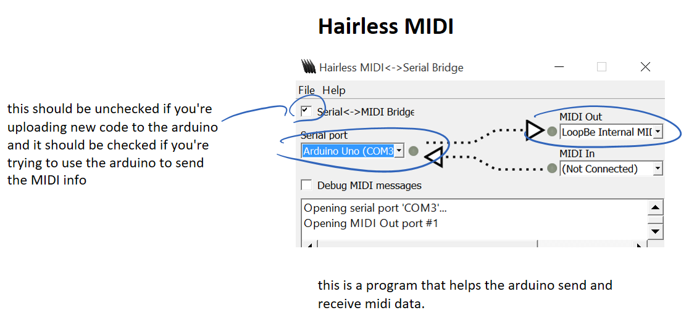
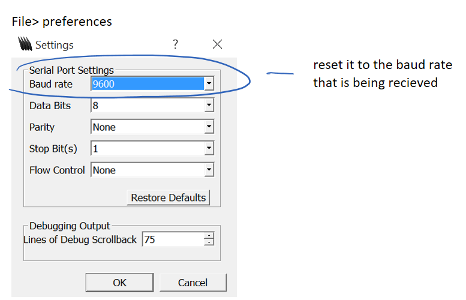

# capacitive_sensor_project
This is a project which is made with regular cables as capacitive triggers that send MIDI signals. Touching the cables that are taped down would trigger the arduino to send the MIDI note to some DAW. I was using Ableton.

There are two versions of this project. The first version is actually slightly better than the second version because the second tried to do too many things that did not implement very well. 

## notes:
There is cardboard in between the resistors and capacitors because I didn't want them touching eachother on the breadboard. I taped down the cabes because I didn't want them to move around so much when I touched them. 

Below are some photos and videos of the build.

**[VIDEO of playing a song in the first version](https://drive.google.com/file/d/1YEL3HLvOCb0wZd_pbSZmtVbuXTWDXZ-J/view?usp=sharing)**

  
  

settings for Hairless MIDI and Loopbe

  
  
  

version two:

  
  

